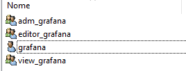
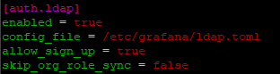
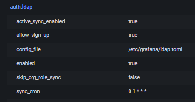

# grafana_ldap_AD_auth
Integrando autenticação de usuários LDAP do Active Directory no Grafana

*Integrando autenticação de usuários LDAP do Active Directory no Grafana.*

Processo de integração da autenticação de usuários LDAP do Active Directory no Grafana. Isso permitirá que os usuários façam login no Grafana usando suas credenciais do Active Directory.

1º - Em seu AD, inicie o *dsa.msc* (Usuários de Computadores do Active Directory).

2º - Irei criar uma OU chamada *Monitoramento*.
Dentro da OU, iremos ter 3 Grupos e 1 usuário para o grafana se autenticar.


| Grupo   | Permissão |
|---------|-------|
| adm_grafana    | Administrador    |
| editor_grafana   | Edição    |
| view_grafana  | Permissão    |


| Usuário   | Permissão |
|---------|-------|
| grafana    | Administrador    |



OBS: Adicione usuários do AD aos grupos para permitir autenticação no Grafana.


3 º - Acesse o terminal do servidor do Grafana, habilite o LDAP na sessão *[auth.ldap]*.

Por padrão, o arquivo de configuração do grafana fica em */etc/grafana/ldap.toml*

*nano /etc/grafana/grafana.ini*



``` 
[auth.ldap]

enabled = true # Habilita a autenticação Ldap.

config_file = /etc/grafana/ldap.toml # Aponta o arquivo de configuração.

allow_sign_up = true # Permite que novos usuários LDAP se registrem automaticamente no Grafana ao fazer login pela primeira vez.

skip_org_role_sync = false # # o Grafana sincroniza os papéis organizacionais dos usuários com base nos grupos LDAP configurados.
```

4º - Edite o arquivo de configuração Ldap localizado em */etc/grafana/ldap.toml* . 

Altere os parâmetros:
```

bind_dn = "grafana@dominio.com" #Distinguished Name é o usuário que o Grafana irá usar para se autenticar.

bind_password = "Senha_do_usuario_grafana" #senha

timeout = 10 #tempo que o Grafana irá aguardar uma resposta do servidor Ldap.

search_filter = "(sAMAccountName=%s)" #Filtro para pesquisar os usuários no Ldap. (sAMAccountName=%s) é um padrão comum de pesquisa do Active Directory, basicamente o =%s irá ser substituído pelos nomes dos usuários. 

search_base_dns = ["dc=dominio,dc=com"] #exemplo: empresa.com. Cria uma lista dos DNs para realizar a busca de usuários.

group_search_base_dns = ["ou=Monitoramento,dc=dominio,dc=com"] #OU do local onde estão os grupos do grafana.

group_search_filter_user_attribute = "sAMAccountName" #Parametro usado para comprar o usuário autenticado com os usuários identificados na busca.

[servers.attributes]
name = "givenName" #Primeiro campo de nome.
surname = "sn" #Campo sobrenome.
username = "sAMAccountName" #busca o login.
member_of = "memberOf" #busca os grupos que o usuário pertence.
email = "mail" #campo e-mail

#Mapeamentos de permissões dos Grupos do AD
#group_dn: define o local completo dos grupos destinados ao Grafana no AD.

[[servers.group_mappings]]
group_dn = "CN=adm_grafana,OU=Monitoramento,dc=dominio,dc=com"
org_role = "Admin"

[[servers.group_mappings]]
group_dn = "cn=editor_grafana,ou=Monitoramento,dc=dominio,dc=com"
org_role = "Editor"

[[servers.group_mappings]]
group_dn = "CN=view_grafana,OU=Monitoramento,dc=dominio,dc=com"
org_role = "Viewer"

[[servers.group_mappings]]
# Esse mapeamento wildcard atribui o papel de Viewer para usuários fora dos grupos específicos
group_dn = "*"
org_role = "Viewer"
```

5º - Reinicie o serviço do Grafana.

*sudo systemctl restart grafana-server*

6º - No front do grafana, vá em *Server admin>Settings* e verifique se o ldap está habilitado no campo *auth.ldap*.




Agora o Grafana está integrado com o AD. Adicione usuários aos Grupos da OU Monitoramentos para conceder acesso ao Grafana.


**Troubleshooting**

**Debug**

Em caso de erro, habilite o debug em seu arquivo */etc/grafana/grafana.ini* .
```
[log]
filters = ldap:debug
```
<br>

**Logs**

Verifique os logs em: */var/log/grafana/grafana.log*

Filtre logs com a palavra "ldap": *grep "ldap" /var/log/grafana/grafana.log*


<br>

**Teste de conexão com o Active Directory.**

Instale os pacotes openldap.

*sudo yum install openldap-clients -y*


*ldapsearch -x -H ldap://dominio.com -D "usuário@dominio.com" -w 'senha_usuário' -b "DC=dominio,DC=com"*

